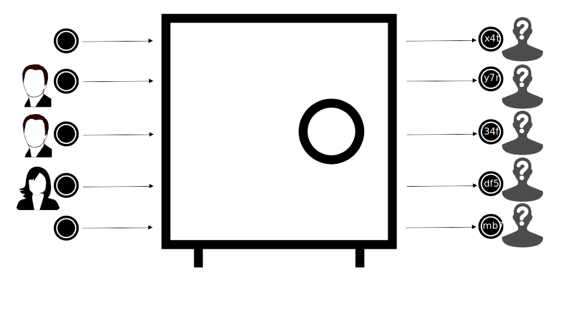

 &rarr; [Repositories](./introduction/repositories.md)

# Table of Contents

1. [Overview](#a-zk-proof-protocol-for-enterprises#)
2. [Repositories](./introduction/repositories.md)
3. [Protocol](./protocol/actors.md)
4. [Tools](./tools/explorer.md#explorer)

# Nightfall - A ZK-Proof Protocol for Enterprises

Nightfall is a privacy-focused rollup designed for enterprise use cases that combines
the concepts of optimistic rollups and Zero-Knowledge (ZK) cryptography to offer private and scalable transactions.

While Nightfall enables scalability, it is also set to remove a major barrier companies face today
when using public blockchains: the lack of privacy of transactions. Nightfall adds a layer of privacy so that key transaction parameters (e.g. value and destination) cannot traced back. These two features have fed the interest of private enterprises that see Nightfall as a way to execute their business logic and coordinate with their supply chain in a decentralized network at a sustainable price, all while maintaining security and privacy.

## Nightfall's Pillars

Nightfall's main value proposition is to enable secure, private, low-cost transfers of
data in a decentralized network.

- **Privacy -** Nightfall uses ZK proofs to send private transactions. A user can generate a ZK proof of
the transaction without revealing key transaction parameters such as the destination or the value of the
transaction. More details about the privacy component of Nightfall are available in the
[`Protocol`](./protocol/actors.md) guide.

- **Security -** Nightfall is a Layer 2 construction because it leverages Ethereum by borrowing its security as a robust
public blockchain.  Nightfall embeds operating rules in different smart contracts to guarantee that block proposers can't block
user transactions, and that users can withdraw their assets at all times.  Nightfall's first security audit can be found [`here`](https://github.com/NightfallRollup/Audits/blob/main/Least%20Authority%20Polygon%20Technology%20Nightfall%203%20Final%20Audit%20Report.pdf).

- **Efficiency -** Block proposers collect transactions from various users and batch them together into an L2 Block.  The expected gas costs for a deposit, transfer, and withdrawal are 9000, 13000 and 10500. This cost is due to storing calldata per transaction, plus some fixed calldata and computation to process an L2 block. Costs will be up to 80% lower after [EIP 4488](https://eips.ethereum.org/EIPS/eip-4488).

- **Non-deniable Transfers -** As part of the transfer transaction ZK proof, Nightfall includes encrypting the secrets (token address, value, id, and salt) required to process the transferred commitment. This forces the user to encrypt the secrets
with a key known to the recipient. As the key is part of the ZK proof, the receiver cannot claim plausible deniability
as the sender can prove that the correct encryption key was used.

- **Decentralized -** [Block Proposers and Challengers](./protocol/actors.md) are an integral part of Nightfall. They ensure that transactions and L2 blocks are produced timely and correctly. A proof-of-stake (PoS) based consensus mechanism is
used to select the next [Proposer](docs/nightfall/protocol/actors) of the network. On the other hand, Challengers monitor
the correct operation of the network by raising challenges when an incorrect block is detected and by retaining the
stake advanced by the Proposer. Nightfall is prepared to enable multiple entities to act as Block Proposers and Challengers.

- **Future Proof -** Thanks to the flexibility provided, it is possible to include new transactions in the future without compromising existing transactions by just defining and registering new circuit types that implement the transaction in ZK.

- **Supply Chain Centric -** Nightfall has been designed focusing on Supply Chain use cases by including private minting, transformation and burning of ERC1155 like assets completely on Layer 2.

- **Self Certification -** To comply with regulatory compliance requirements, Nightfall now mandates self certification of users to be allowed to perform deposits and withdrawals. Self certification is carried out using X509 certificates. In addition, addresses are verified against sanction lists before allowing any transaction on Nightfall.

- **Selective De-anonimization -** Transfers can now be selectively de-anonimized. Users may configure their transfers so that a known third party apart from the intended recipient is able to decode the transactions without this third party being able to spend those funds. Use cases for this functionality include supply chain managers wanting to oversee all transactions from multiple suppliers, warehouses, etc, ..., as well as regulator entities requiring access to all transactions in the network.

## References

1. [Paul's Brody view on Nightfall](https://www.linkedin.com/pulse/say-hello-nightfall-paul-brody-1f/)
2. [Achieving Crypto Privacy and Regulatory Compliance](https://a16zcrypto.com/achieving-crypto-privacy-and-regulatory-compliance/)

