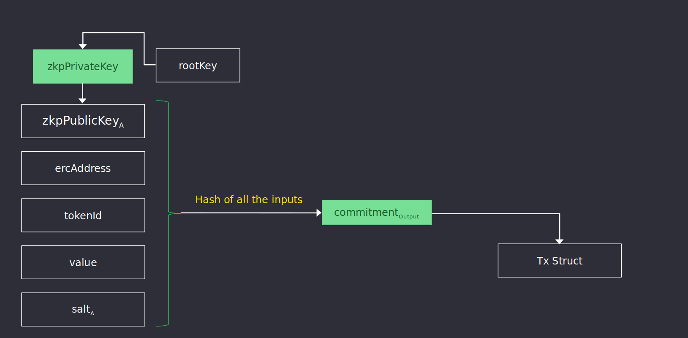
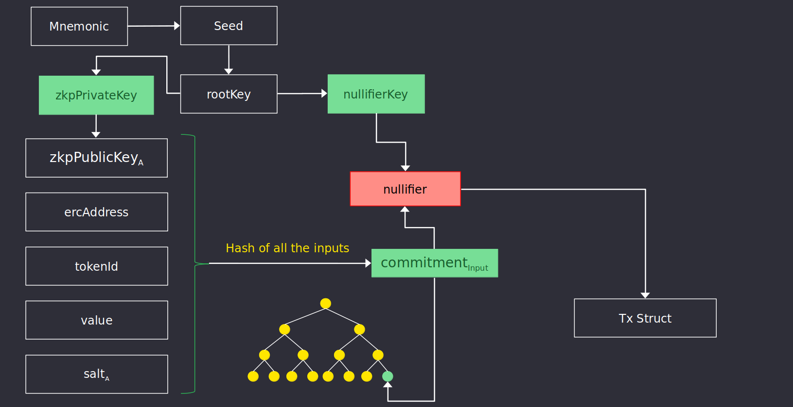
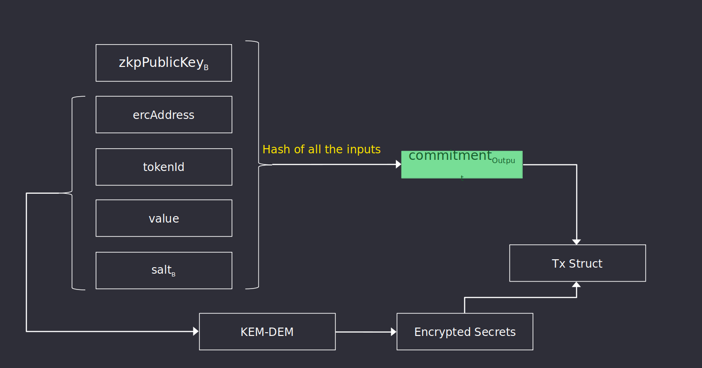
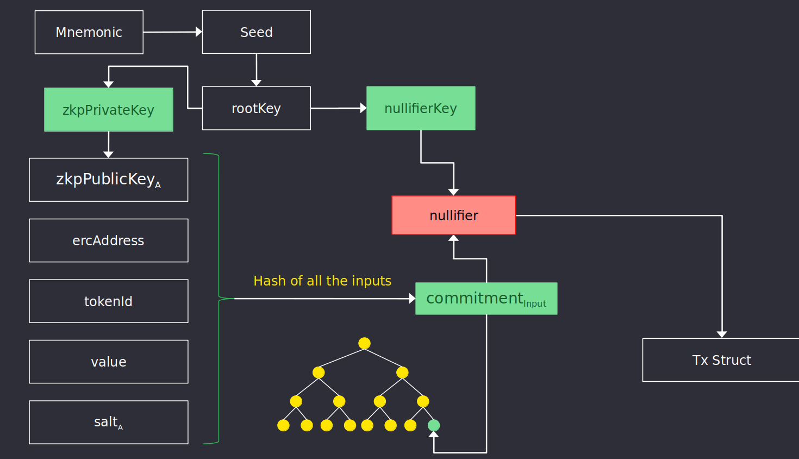

&larr; [Main](../README.md) &nbsp;&nbsp;&nbsp;&nbsp;&nbsp;&nbsp; &rarr; [Next](./mpc.md#mpc)

# Protocol
1. [Actors](./actors.md#actors)
2. [Contracts](./contracts.md#contracts)
3. [Circuits](#circuits)
4. [MPC](./mpc.md#mpc-ceremony)
5. [Keys](./keys.md#keys)
6. [Commitments](./commitments.md#commitments)
7. [Nullifiers](./nullifiers.md#nullifiers)
8. [Secrets](./secrets.md#secrets)
9. [Transactions](./transactions.md#transactions)
10. [Fees](./fees.md#fees)
11. [Certificates](./certificates.md#certificates)
12. [Sanctions List](./certificates.md#sanctions-list)

# Circuits

Circuits are used to define the rules that a transaction must follow to be considered correct. There are broadly three types of circuits, one for each type of transaction:

- [Deposit](#deposit)
- [Transfer](#transfer)
- [Withdraw](#withdraw)

Every transaction includes a ZK Proof following the constraints specified in these circuits. Users construct this proof using a Wallet, or through a Client server.  A proof is generated only if all rules included in the circuit are correct. For example, a transfer will be correct if all the following cases are true:

- New [commitment](./commitments.md#commitments) is valid
- Old [commitment](./commitments.md#commitments) is valid and owned by the sender
- [Nullifier](./commitments.md#nullifiers) is valid 
- Merkle Tree path / root is valid
- Ciphertext containing commitment is valid

## Deposit
Deposits convert publicly visible ERC tokens into a token commitment that holds the same value or token id as that of the original token, and the Nightfall public key of the intended commitment owner. 

Leaked information of a deposit transaction include the address that minted the new commitment and the address, value and id of the ERC token being used.

## Transfer
Transfers enable the transmission of up several commitments of the same asset between two parties by nullifying the sender's existing commitments and creating new ones. Spent commitments will be used to cover the amount of the transfer value and also the proposer's fee.

Source commitments can be combined to form a new commitment of higher value to match the transfer's expected value plus antoher commitment with the excess change. Simultaneously, source commitments can be also combined to generate the proposer's fee and excess change.

Transfers allow to combine up to 4 input commitments to cover the transfer value and the proposer's fee.

The information leaked will be that some commitments have been nullified, nd that new commitments have been created.
Information on the new owner, which commitments were spent or the amount transferred remains private.

First diagram goes over the steps around nullifying an existing commitment (or commitments) and adding the information to the [`transaction`](./transactions.md#transactions) data structure. 

Second diagram goes over the steps required to generate and encrypt the newly created commitment.

## Withdraw
Withdraw is the operation of nullifying an existing Nightfall commitments and converting them into publicly visible ERC tokens with the same value and token Id as the burnt commitments. Withdraw is the opposite operation to Deposit. Similarly to transfers, withdrawals accept as input several commitments that are used to cover the withdrawal value and the proposer's fee.

Information leaked during a withdrawal includes the address of the address that withdrew the commitment and the value, token Id and address of the token withdrawn.

### Cooling off period

Withdrawals require a `COOLING OFF` period of one week to finalize. This is due to the optimistic nature of Nightfall, since a new block is assumed to be correct until some challenger submits a fraud proof. The funds are held until one week has passed and they can be withdrawn to L1. 

