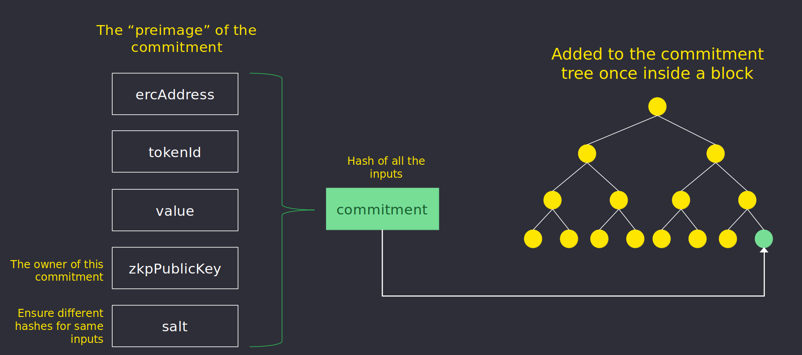

&larr; [Main](../README.md) &nbsp;&nbsp;&nbsp;&nbsp;&nbsp;&nbsp; &rarr; [Next](./nullifiers.md#nullifiers)

# Protocol
1. [Actors](./actors.md)
2. [Contracts](./contracts.md)
3. [Circuits](./circuits.md)
4. [MPC](./mpc.md)
5. [Keys](./keys.md)
6. [Commitments](#commitments)
7. [Nullifiers](./nullifiers.md#nullifiers)
8. [Secrets](./secrets.md)
9. [Transactions](./transactions.md)
10. [Fees](./fees.md#fees)
11. [Certificates](./certificates.md)
12. [Sanctions List](./certificates.md#sanctions-list)

# Commitments

A commitment is a cryptographic primitive that allows a user to commit to a chosen value 
while keeping it hidden to others, with the ability to reveal the committed value later. 
Confidentiality of value and recipient is attained in this manner.

Every transaction using Nightfall involes a new new Zero Knowledge Proof (ZKP) and the creation and/or nullification of a commitment.  For instance, one creates a commitment when making a deposit or a transfer and nullifies a commitment when 
making a transfer or a withdrawal.

ZKP computation relies on [`circuits`](./circuits.md) that define the rules which a transaction must follow to be correct. 

The commitment is used to hide the following properties:
- **ERC address of the token**
- **Token Id**
- **Value**
- **ZKP Public Key**
- **Salt**

This set of properties is often referred as the *commitment preimage*. Knowledge of the commitment preimage represents knowledge of the owner of the commitment.

## **UTXO**

Commitments are created during deposits and transfers, and are spent during transfers and withdrawals transactions. **Commitments are not aggregated together**. When spending a commitment, the value of the commitment spent is limited to the value of up to *N* commitnents owned, where *N* is defined by the transactions.

Current ZKP transfer and withdraw circuits used in Nightfall are restricted to using up to 4 commitment inputs, which are used to select transfer or withdrawal amounts and the fees to the proposer.  If a transactor's set of commitments contain primarily low value commitments (dust), they may find it hard to conduct future transfers as it may not be possible to combine different commitments to obtain the target transfer/withdrawal amount.

In order to select the best suitable commitments, the algorithm:
1. Gets all the user-owned commitments related to the transaction `ercAddress` in ascending order
2. Verifies there exists a combination of up to 4 commitments that suits the target transaction
3. Selects the commitments used, giving priority to the smallest ones

Observe the following value sets:

- **Set A**: [1, 1, 1, 1, 1, 1, 1, 1, 1, 1]
- **Set B**: [2, 2, 2, 2, 2]
- **Set C**: [2, 8]

While all three sets have equivalent total sums, the maximum value transfer that can be transacted by sets *A*, *B*, and *C* are 4, 8, and 10 respectively. This is one of the reasons why large commitment values are preferred. The commitment selection strategy used mitigates this risk by prioritising the use of small value commitments while also minimising the creation of dust commitments.

