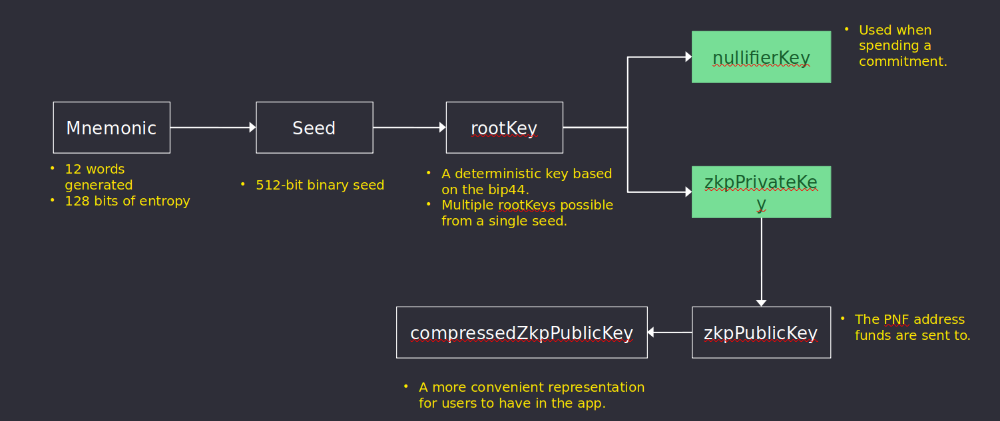

&larr; [Main](../README.md) &nbsp;&nbsp;&nbsp;&nbsp;&nbsp;&nbsp; &rarr; [Next](./commitments.md#commitments)

# Protocol
1. [Actors](./actors.md)
2. [Contracts](./contracts.md)
3. [Circuits](./circuits.md)
4. [MPC](./mpc.md)
5. [Keys](#keys)
6. [Commitments](./commitments.md)
7. [Nullifiers](./nullifiers.md#nullifiers)
8. [Secrets](./secrets.md)
9. [Transactions](./transactions.md)
10. [Fees](./fees.md#fees)
11. [Certificates](./certificates.md)
12. [Sanctions List](./certificates.md#sanctions-list)

# Keys

Nightfall uses different keys to enable a user to spend a commitment and to visualize a commitment. The key derivation mechanism followed in Nightfall is depicted in the Figure below.



The derivation process starts with a valid BIP39 12 word mnemonic that is converted to a 512-bit binary seed,
which is used to derive a deterministic `rootKey` based on standards BIP32 and BIP44. This `rootKey` is the source key used to derive the rest of the keys:

- `nullifierKey` is used to spend a commitment, and it is formed by hashing the  `rootKey` and some predefined number.
- `zkpPrivateKey` allows to transfering and viewing the commitment. It is formed by hashing the `rootKey` by some predefined number.

If either `rootKey` or `mnemonic` is compromised, then the adversary can calculate the `zkpPrivateKey` and `nullifierKey`.
The `zkpPrivateKey` can be used to decrypt secrets of a commitment whilst the `nullifierKey` can be used to spend the commitment.
Hence `rootKey` and `mnemonic` must be stored very securely.  It is also recommended to store `zkpPrivateKey` and `nullifierKey` separately to avoid theft of commitments in case one of these is compromised.

The pseudo-code excerpt below shows how the different keys are generated:
```
  const BN128_GROUP_ORDER = 21888242871839275222246405745257275088548364400416034343698204186575808495617n;
  const BABYJUBJUB = {
    GENERATOR: [
      BigInt('16540640123574156134436876038791482806971768689494387082833631921987005038935'),
      BigInt('20819045374670962167435360035096875258406992893633759881276124905556507972311'),
    ],
  };
  const seed = mnemonicToSeedSync(mnemonic);
  const rootKey = generalise(
    new GN(
      hdkey
        .fromMasterSeed(seed)
        .derivePath(`m/44'/60'/0'/0/${addressIndex}`)
        .getWallet()
        .getPrivateKey(),
    ).bigInt % BN128_GROUP_ORDER,
  );
  const zkpPrivateKey = poseidon([
    rootKey,
    new GN(2708019456231621178814538244712057499818649907582893776052749473028258908910n),
  ]);
  const nullifierKey = poseidon([
    rootKey,
    new GN(7805187439118198468809896822299973897593108379494079213870562208229492109015n),
  ]);
  const scalarResult: string[] = scalarMult(zkpPrivateKey.hex(32), BABYJUBJUB.GENERATOR);
  const zkpPublicKey = generalise(scalarResult);
  const compressedZkpPublicKey = new GN(
    edwardsCompress([zkpPublicKey[0].bigInt, zkpPublicKey[1].bigInt]),
  );
```