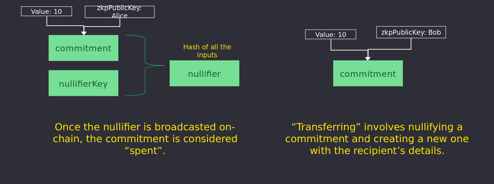

&larr; [Main](../README.md) &nbsp;&nbsp;&nbsp;&nbsp;&nbsp;&nbsp; &rarr; [Next](./secrets.md#secrets)

# Protocol
1. [Actors](./actors.md)
2. [Contracts](./contracts.md)
3. [Circuits](./circuits.md)
4. [MPC](./mpc.md)
5. [Keys](./keys.md)
6. [Commitments](./commitments.md#commitments)
7. [Nullifiers](#nullifiers)
8. [Secrets](./secrets.md)
9. [Transactions](./transactions.md)
10. [Fees](./fees.md#fees)
11. [Certificates](./certificates.md)
12. [Sanctions List](./certificates.md#sanctions-list)
# Nullifiers

A **Nullifier** is the result of hashing together a commitment and the nullifier key. They are stored on-chain as part of the call data during block proposal. Once the nullifier is broadcasted on-chain, the commitment is considered spent.

